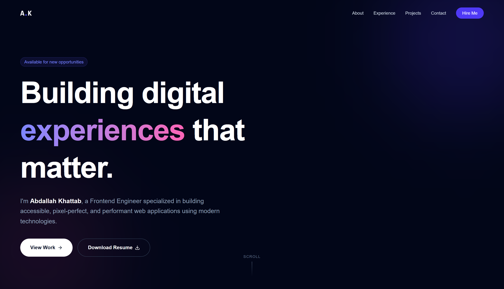

# Personal Portfolio

Showcase of my work, skills, and experience as a Frontend Developer. Built with a modern React stack focused on performance, accessibility, and delightful interactions.

---

## Live Demo

- **Website:** [Add your deployment URL here](https://your-deployment-url.com)
- **Preview:**

```html
<!-- Place a screenshot at public/preview.png for this to render on GitHub -->

```

---

## Project Overview

This is my personal portfolio website designed to highlight my projects, capabilities, and experience. It features a clean, responsive UI, smooth animations, and an intuitive structure that makes it easy for visitors to explore my work and get in touch.

---

## Features

- **Responsive Design**: Optimized for mobile, tablet, and desktop.
- **Clean UI**: Minimal, modern layout with consistent spacing and typography.
- **Smooth Animations**: Page and component transitions using Framer Motion.
- **Projects Showcase**: Highlighted projects with descriptions and links.
- **Contact Section**: Email form powered by EmailJS.
- **Smooth Navigation**: Section-based navigation and scroll behavior.
- **Performance-first**: Fast dev and build via Vite.

---

## Tech Stack

- **Framework:** React (v19)
- **Build Tool:** Vite (v7)
- **Styling:** Tailwind CSS (v4)
- **Animations:** Framer Motion (v12)
- **Icons:** React Icons
- **Email/Forms:** @emailjs/browser
- **Linting/Quality:** ESLint

---

## Folder Structure

```text
.
├─ public/
│  ├─ Abdallah_Khattab_Frontend Developer_resume (1).pdf
├─ src/
│  ├─ assets/
│  ├─ components/
│  ├─ constants.jsx
│  ├─ App.jsx
│  ├─ index.css
│  └─ main.jsx
├─ index.html
├─ package.json
├─ vite.config.js
├─ eslint.config.js
└─ README.md
```

---

## Installation & Setup

Prerequisites:

- Node.js >= 18
- npm 

Steps:

```bash
# 1) Install dependencies
npm install

# 2) Start the development server
npm run dev

# 3) Create a production build
npm run build

# 4) Preview the production build locally
npm run preview
```

Optional configuration:

- If you enable the contact form with EmailJS, create an `.env` file and add your EmailJS keys. Do not commit secrets to Git.

---

## Future Improvements

- **SEO & Open Graph**: Metadata, sitemap, structured data.
- **Dark Mode Toggle**: Persisted theme preference.
- **More Projects**: Case studies with screenshots and write-ups.
- **Blog/Articles**: Optional section for writing.
- **Internationalization**: i18n with language switcher.
- **Automated Testing**: Unit and e2e tests.

---

## License

This project is open source under the **MIT License**. You are free to use, modify, and distribute it with attribution.
